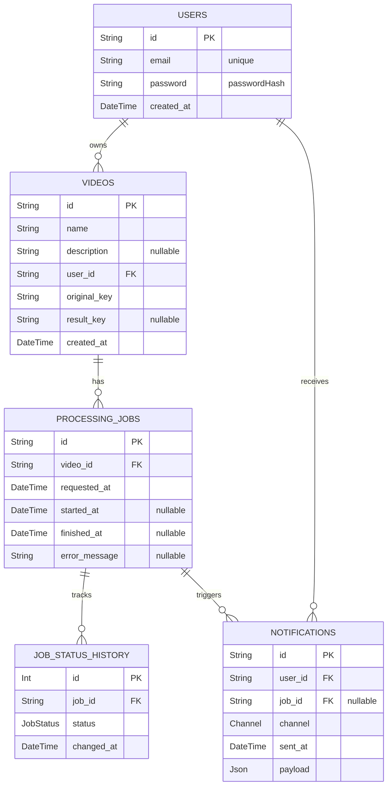

# Hackathon Backend

[](https://sonarcloud.io/summary/new_code?id=8SOAT-GRUPO-41_hackathon-backend)
[](https://sonarcloud.io/summary/new_code?id=8SOAT-GRUPO-41_hackathon-backend)

## Descrição do Projeto

Este é um projeto backend para o hackathon da 8SOAT - Grupo 41.

## Configuração do Ambiente


```bash
# AWS
AWS_REGION=us-east-1
AWS_ACCESS_KEY_ID=your_aws_access_key_id
AWS_SECRET_ACCESS_KEY=your_aws_secret_access_key

# SQS
SQS_QUEUE_URL=https://sqs.us-east-1.amazonaws.com/your-account-id/your-queue-name

# API
PORT=3000

# Logging
LOG_LEVEL=info
```

## Database Schema

Abaixo está o diagrama do banco de dados:



## SQS Consumer

A aplicação inclui um consumidor SQS que inicia automaticamente quando a aplicação é executada. Ele faz polling contínuo em uma fila SQS para receber mensagens, processá-las e registrar o conteúdo.

Para personalizar o comportamento do consumidor SQS, você pode modificar a classe `SQSConsumer` em `src/infrastructure/consumers/sqs-consumer.ts`.

## Como Iniciar o Projeto Localmente

Para iniciar o projeto localmente, siga os passos abaixo:

1. Certifique-se de que o Docker está instalado e em execução.
2. No diretório raiz do projeto, execute o seguinte comando:

```bash
docker-compose up
```

3. A API estará disponível em [http://localhost:3000](http://localhost:3000)

## Como Iniciar o Projeto no Kubernetes

[Guia de deploy helm + k8s](k8s/README.md)

## Executando sem Docker

```bash
# Instalar dependências
yarn install

# Executar em modo de desenvolvimento
yarn dev

# Compilar para produção
yarn build

# Executar em modo de produção
yarn start
```

## Tecnologias Utilizadas

- Node.js com TypeScript
- Fastify
- AWS SQS
- PostgreSQL
- Docker
- Kubernetes
- Helm 

# Arquitetura

